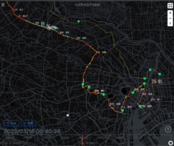

# 小江戸大江戸 2025 シミュレータ

小江戸大江戸マラソン 2025 のレース進行をシミュレートするための可視化ツールです。ランナーの位置情報を地図上に表示し、レースの進行状況を時系列で確認できます。



## 機能

- **インタラクティブな地図表示**: MapLibre と deck.gl を使用した高性能な地図表示
- **レース進行のアニメーション**: タイムライン上でレースの進行をアニメーション表示
- **カテゴリフィルタリング**: 特定のカテゴリ（例：男子、女子など）のランナーのみを表示
- **ランナー検索**: ゼッケン番号や名前で特定のランナーを検索・フォーカス
- **カスタマイズ可能な表示**: ポイントサイズ、フォントサイズなどの調整
- **レスポンシブデザイン**: Tailwind CSS を使用したモバイル対応デザイン

## 技術スタック

- **フロントエンド**: React + TypeScript
- **状態管理**: Zustand
- **地図表示**: deck.gl + MapLibre GL
- **スタイリング**: Tailwind CSS
- **ビルドツール**: Vite
- **テスト**: Vitest

## 開発環境のセットアップ

### 前提条件

- Node.js (v18 以上)
- pnpm

### インストール

```bash
# リポジトリのクローン
git clone https://github.com/sugasaki/coedo-ooedo-2025-simulator.git
cd coedo-ooedo-2025-simulator

# 依存関係のインストール
pnpm install
```

### 開発サーバーの起動

```bash
pnpm dev
```

### ビルド

```bash
pnpm build
```

### テスト実行

```bash
pnpm test
```

## データソース

シミュレーションに使用されるデータは以下のリポジトリから取得・加工されています：

[https://github.com/sugasaki/simulator-data-geter](https://github.com/sugasaki/simulator-data-geter)

## デプロイ

GitHub Pages へ自動デプロイしています。デプロイ設定は以下のファイルで管理されています：

```
.github/workflows/deploy-gh-pages.yml
```

## プロジェクト構成

- `src/components/`: UI コンポーネント
- `src/hooks/`: カスタム React フック
- `src/store/`: Zustand を使用した状態管理
- `src/utils/`: ユーティリティ関数
- `src/data/`: シミュレーションデータ
- `src/types/`: TypeScript 型定義
- `CLAUDE.md`: 開発ガイドラインとClaude AIアシスタント用の設定ファイル

## 主要コンポーネント

- **DeckGLMap**: 地図とランナー位置の表示
- **AnimationFrame**: アニメーションのフレーム管理
- **RaceTimeline**: レース進行のタイムライン表示
- **DrawerMenu**: 設定・フィルタリングメニュー

## ライセンス

このプロジェクトは[MIT ライセンス](LICENSE)の下で公開されています。
